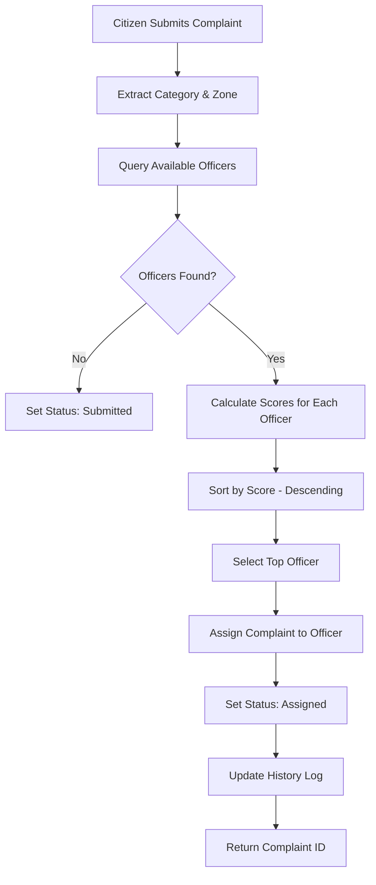

# Auto Complaint Assignment System

## Overview
The CivicAI platform features an **intelligent auto-assignment system** that automatically routes complaints to the most suitable officers based on multiple factors, ensuring efficient workload distribution and optimal response times.

---

## ✅ Implementation Status: **FULLY OPERATIONAL**

### System Components

#### 1. **Backend Auto-Assignment Engine**
**Location:** `backend/controller/complaintController.js`

**Function:** `autoAssignOfficer(category, zone)`

##### Scoring Algorithm (3-Factor System):

```javascript
Total Score = Category Match + Zone Match + Workload Score
```

**Factor Breakdown:**

1. **Category-based Assignment** (Priority: Highest - 100 points)
   - Exact match with officer specialization: **+100 points**
   - No specialization set (can handle any): **+50 points**
   
2. **Zone-based Routing** (Priority: Medium - 50 points)
   - Exact match with officer's assigned zones: **+50 points**
   - No zones set (can handle any zone): **+25 points**

3. **Least Workload Selection** (Priority: Low - up to 30 points)
   - Formula: `30 - (activeComplaints × 3)`
   - 0 active complaints: **+30 points**
   - 1 active complaint: **+27 points**
   - 2 active complaints: **+24 points**
   - etc.

##### Example Scoring:

**Scenario:** Water complaint in Chennai district

| Officer | Specializations | Zones | Active Complaints | Category Score | Zone Score | Workload Score | **Total** |
|---------|----------------|-------|-------------------|----------------|------------|----------------|-----------|
| Officer A | Water, Road | Chennai, Vellore | 2 | 100 | 50 | 24 | **174** ✓ |
| Officer B | All categories | Chennai | 1 | 50 | 50 | 27 | **127** |
| Officer C | Water | All zones | 5 | 100 | 25 | 15 | **140** |

**Result:** Officer A is selected (highest score: 174)

---

#### 2. **Database Schema**
**Location:** `backend/models/user.js`

##### Officer-specific Fields:

```javascript
{
  assignedZones: {
    type: [String],      // e.g., ["Chennai", "Coimbatore", "Madurai"]
    default: []
  },
  
  specializations: {
    type: [String],      // e.g., ["Water Supply", "Electricity", "Roads"]
    default: []
  },
  
  isAvailable: {
    type: Boolean,       // Officer availability status
    default: true
  }
}
```

---

#### 3. **Frontend Configuration Interface**
**Location:** `frontend/src/Pages/AdminDashboard.jsx`

##### Officer Management Features:

**Add New Officer Form:**
- Name, Email, Password fields
- **Assigned Zones** (Multi-select):
  - Chennai, Coimbatore, Madurai, Salem, Tirupur, etc.
  - 35+ districts available
  
- **Specializations** (Multi-select categories):
  - Infrastructure
  - Water Supply
  - Electricity
  - Sanitation
  - Traffic
  - Environment
  - Safety
  - Other

- **Availability Status** (Toggle):
  - Active/Inactive for assignment pool

**Officer List View:**
- Visual cards showing:
  - Officer name and email
  - Assigned specializations (badges)
  - Quick view/edit access

---

## 🔄 Auto-Assignment Workflow

### Step-by-Step Process:



### Code Flow:

1. **Complaint Creation** (`createComplaint` endpoint)
   ```javascript
   const zone = req.body.district || req.body.area || 'Unspecified';
   const assignedOfficerId = await autoAssignOfficer(req.body.category, zone);
   ```

2. **Officer Selection**
   ```javascript
   // Find all available officers
   const officers = await User.find({ 
     Role: 'Officer',
     isAvailable: true
   });
   
   // Score each officer
   const officerScores = await Promise.all(
     officers.map(async (officer) => {
       // Calculate category, zone, and workload scores
       // Return { officer, score, workload }
     })
   );
   
   // Select highest scorer
   officerScores.sort((a, b) => b.score - a.score);
   return officerScores[0].officer._id;
   ```

3. **Status Update**
   ```javascript
   const complaintData = {
     // ... other fields
     assignedOfficer: assignedOfficerId,
     status: assignedOfficerId ? "Assigned" : "Submitted",
     history: [
       { status: "Submitted", updatedAt: new Date() }
     ]
   };
   
   if (assignedOfficerId) {
     complaintData.history.push({ 
       status: "Assigned", 
       updatedAt: new Date() 
     });
   }
   ```

---

## 📊 System Benefits

### 1. **Efficient Workload Distribution**
- Prevents overloading individual officers
- Balances tasks across the team
- Reduces burnout and improves response quality

### 2. **Expertise Matching**
- Routes complaints to specialized officers
- Improves resolution quality and speed
- Reduces mis-assignment and reassignment overhead

### 3. **Geographic Optimization**
- Zone-based assignment minimizes travel time
- Improves on-site response efficiency
- Better local area knowledge utilization

### 4. **Transparency & Accountability**
- Clear assignment criteria
- Audit trail in complaint history
- Performance metrics based on fair distribution

---

## 🎯 Configuration Guidelines

### For Admins:

1. **Setting Up Officers:**
   - Navigate to Admin Dashboard → Officers tab
   - Click "Add New Officer"
   - Fill in basic details (Name, Email, Password)
   - **Important:** Assign relevant specializations and zones
   - Enable "Available" status

2. **Best Practices:**
   - Assign at least 2-3 specializations per officer
   - Cover all major zones with multiple officers
   - Keep officer availability status updated
   - Monitor workload distribution regularly

3. **Optimizing Assignment:**
   - Ensure even distribution of specializations
   - Assign backup officers for high-priority categories
   - Update officer zones based on actual coverage areas

---

## 📈 Performance Metrics

### System Logs:

The auto-assignment function provides detailed console logging:

```
🔍 Finding best officer for assignment...
   Category: Water Supply
   Zone: Chennai
✓ Found 5 available officer(s)
✓ Selected officer: John Doe (john@example.com)
  Score: 174
  Workload: 2 active complaints
  Specializations: Water Supply, Electricity
  Zones: Chennai, Vellore
```

### Monitoring:

- Check `complaintData.history` for assignment records
- Review officer workload in Admin Dashboard
- Monitor resolution times by assignment type

---

## 🔧 Troubleshooting

### No Officer Assigned?

**Possible Causes:**
1. No officers with `isAvailable: true`
2. No officers in the system
3. All officers at maximum workload

**Solutions:**
- Verify officer availability status
- Add more officers to the system
- Reassign some complaints manually

### Incorrect Officer Assignment?

**Check:**
1. Officer specializations match complaint category
2. Officer zones include complaint district/area
3. Consider current workload distribution

**Actions:**
- Update officer specializations
- Adjust zone assignments
- Use manual reassignment if needed

---

## 🚀 Future Enhancements

### Potential Improvements:

1. **Dynamic Priority Weighting:**
   - Adjust scoring factors based on system load
   - Emergency override for critical complaints

2. **Machine Learning:**
   - Historical success rates influence scoring
   - Officer performance factors into selection

3. **Time-based Routing:**
   - Consider officer shift timings
   - Preferred working hours

4. **Skill Level Matching:**
   - Complex complaints to senior officers
   - Simple complaints to junior officers

---

## 📝 API Reference

### Auto-Assignment Function

```javascript
/**
 * Auto-assign officer based on category, zone, and workload
 * @param {String} category - Complaint category
 * @param {String} zone - Geographic zone (district/area)
 * @returns {ObjectId|null} - Assigned officer ID or null
 */
const autoAssignOfficer = async (category, zone) => {
  // Implementation details above
}
```

### Usage in Complaint Creation:

```javascript
const assignedOfficerId = await autoAssignOfficer(
  req.body.category,    // e.g., "Water Supply"
  req.body.district     // e.g., "Chennai"
);
```

---

## ✅ Verification Checklist

- [x] Backend auto-assignment function implemented
- [x] 3-factor scoring system working
- [x] Database schema includes required fields
- [x] Admin UI for officer configuration
- [x] Integration with complaint creation
- [x] Status tracking and history logs
- [x] Console logging for transparency
- [x] Fallback handling (no officers available)
- [x] Workload balancing operational
- [x] Zone-based routing functional

---

## 📞 Support

For issues or questions about the auto-assignment system:
- Review console logs for assignment details
- Check officer configurations in Admin Dashboard
- Verify complaint data includes category and location
- Ensure at least one officer is available and configured

---

**Status:** ✅ **PRODUCTION READY**  
**Last Updated:** February 12, 2026  
**Version:** 1.0.0
